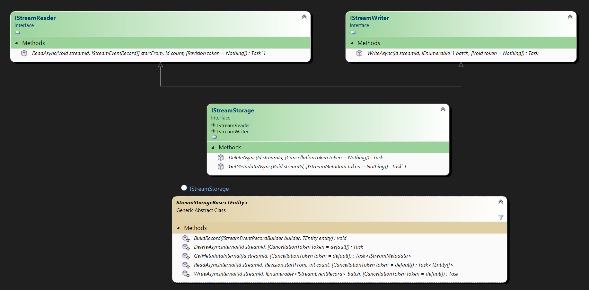

# Customization

To implement your own storage you do not need StreamStore package, you can either implement all necessary interfaces from StreamStore.Contracts or inherit base abstract implementation from StreamStore.Storage package:

```dotnetcli
  dotnet add package StreamStore.Storage
```

or from NuGet Package Manager Console:

```powershell
  Install-Package StreamStore.Storage
```

## Serialization

About serialization you can read in [SERIALIZATION](SERIALIZATION.md) file.

## Create your own storage implementation

### Implement your own storage

To create your own storage implementation, you need to implement the following interfaces:

- [`IStreamStorage`][IStreamStorage] - provides methods for working with streams.
  Create your own implementation based on [`StreamStorageBase`](../src/StreamStore.Storage/StreamStorageBase.cs) abstract class.



### Implement storage provisioning

To make your storage support automatic  provisioning of your storage, you must implement [`ISchemaProvisioner`](../src/StreamStore.Contracts/Provisioning/ISchemaProvisioner.cs) interface.

### Multitenancy

To make your storage support multitenancy, you must implement:

* [`ITenantStreamStorageProvider`](../src/StreamStore.Contracts/Multitenancy/ITenantStreamStorageProvider.cs) interface, provider of IStreamStorage for particular tenant.
* [`ITenantSchemaProvisionerFactory`](../src/StreamStore.Contracts/Provisioning/ITenantSchemaProvisionerFactory.cs) interface, factory of ISchemaProvisioner for particular tenant.

### Register your storage implementation and dependencies in DI container

To provide ability to use your storage implementation as single tenant, you must implement extension method for `IServiceCollection` with following signature:

```csharp
 public static ISingleTenantConfigurator Use[YourStorage](this ISingleTenantConfigurator registrator)
{
   ...
}
```

example:

```csharp
  public static ISingleTenantConfigurator UseInMemoryStorage(this ISingleTenantConfigurator registrator)
  {
      return registrator.UseStorage<InMemoryStreamStorage>();
  }
```

To provide ability to use your storage implementation as multitenant, you must implement extension method for `IServiceCollection` with following signature:

```csharp
  public static IMultitenancyConfigurator Use[YourStorage](this IMultitenancyConfigurator registrator)
  {
    ...
  }
```

example:

```csharp
  public static IMultitenancyConfigurator UseInMemoryStorage(this IMultitenancyConfigurator registrator)
  {
      return registrator.UseStorageProvider<InMemoryStreamStorageProvider>();
  }
```

More complex examples you can find in implementations of particular storage.

## Considerations

- To implement your own storage you do not need StreamStore package, all necessary interfaces are located in [StreamStore.Contracts](https://www.nuget.org/packages/StreamStore.Contracts/) and base implementations in  [StreamStore.Storage](https://www.nuget.org/packages/StreamStore.Storage/) package.
- _You can register your own storage implementation in the DI container using any kind of lifetime (i.e. Singleton, Transient, Scoped, etc.)_  

  However, if you register it as a singleton, you should be aware that it should be thread-safe and preferably stateless.

- _Solution already provides optimistic concurrency and event duplication control mechanisms, as a **pre-check** during stream opening_.  

  However, if you need consistency guaranteed, you should implement your own mechanisms as a part of [IStreamWriter] implementation.  
  For instance, you can use a transaction mechanism supported by `ACID compliant DBMS`.

- _Get and Delete operations must be implemented as idempotent by their nature._

[IStreamWriter]: ../src/StreamStore.Contracts/Storage/IStreamWriter.cs
[IStreamStorage]: ../src/StreamStore.Contracts/Storage/IStreamStorage.cs
