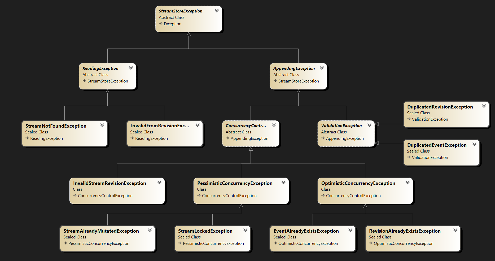

# Error handling

Error handling in StreamStore is designed to be robust and user-friendly. The library provides a set of exceptions that can be thrown during various operations, allowing developers to handle errors gracefully.

As you can see in the class diagram below, all exceptions in StreamStore derive from the base exception class `StreamStoreException`. This allows for consistent error handling across the library.

Also reading and appending exceptions are separated into `ReadingException` and `AppendingException`, so you can handle them differently if needed.

Library provides ability to handle inconsistency of uncommitted (in memory) events, before committing changes to the stream, using `ValidationException`.

Library also provides ability to handle exceptions in a more granular way, for instance handle exceptions related to concurrency issues using `ConcurrencyException`, or related to specific type of concurrency control using `PessimisticConcurrencyException` or `OptimisticConcurrencyException`.

 
