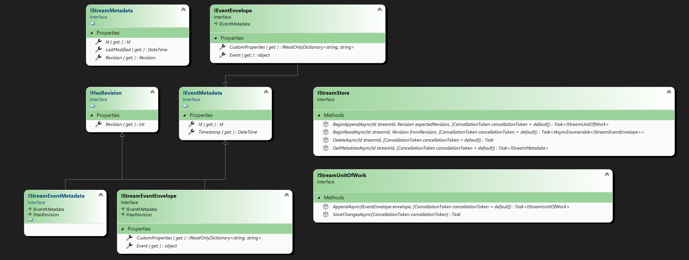

# StreamStore

[](https://github.com/kostiantyn-matsebora/streamstore/actions/workflows/build.yml) [](https://sonarcloud.io/summary/new_code?id=kostiantyn-matsebora_streamstore)
[](https://sonarcloud.io/summary/new_code?id=kostiantyn-matsebora_streamstore)
[](https://www.nuget.org/packages/StreamStore/)

Asynchronous event sourcing.

Library provides a logical layer for storing and querying events as a stream.

Heavily inspired by Greg Young's Event Store and [`Streamstone`](https://github.com/yevhen/Streamstone) solutions.

## Overview

Designed to be easily extended with custom storage backends.
Despite the fact that component implements a logical layer for storing and querying events as a stream,
 `it does not provide functionality of DDD aggregate`, such as state mutation, conflict resolution etc., but serves more as `persistence layer`  for it.

 

## Packages

  | Package                | Description                                                                            | Concurrency Control  |       Multitenancy        | Event Duplication Detection | Package   |
  | ---------------------------- | ----- |------------------------------------------------------------------------------------ | ----------------- | -----------|--------------------------------------------------------------------------------------------------------------------------------------------------------- |
  | [StreamStore.NoSql.Cassandra] | [`Apache Cassandra`] and [`Azure Cosmos DB for Apache Cassandra`] storage | [`Optimistic`] | :white_check_mark: | :x: | [](https://www.nuget.org/packages/StreamStore.NoSql.Cassandra/)  
  | [StreamStore.Sql.PostgreSql] | [`PostgreSQL`](https://www.postgresql.org/) storage | [`Optimistic`] | :white_check_mark: | :white_check_mark: | [](https://www.nuget.org/packages/StreamStore.Sql.PostgreSql/)
  | [StreamStore.Sql.Sqlite]     | [`SQLite`](https://www.sqlite.org/index.html) storage | [`Optimistic`] | :white_check_mark: |  :white_check_mark: | [](https://www.nuget.org/packages/StreamStore.Sql.Sqlite/)
  | [StreamStore.InMemory]       | **In-memory** storage is provided **for testing and educational purposes only** | [`Optimistic`] | :white_check_mark: | :white_check_mark: | [](https://www.nuget.org/packages/StreamStore.InMemory/) |
  | [StreamStore.S3.AWS]         | [`Amazon S3`] storage                                                         | [`Distributed Lock`] |:x: | :x: |[](https://www.nuget.org/packages/StreamStore.S3.AWS/)       |
  | [StreamStore.S3.B2]          | [`Backblaze B2`] storage (not working at the moment!)                                                      |[`Distributed Lock`] |:x: | :x: |[](https://www.nuget.org/packages/StreamStore.S3.B2/)          |

## Concepts

About basic concepts you can read in [CONCEPTS.md](../docs/CONCEPTS.md).

## Features

The general idea is to highlight the common characteristics and features of event sourcing storage:

- [x] Asynchronous read and write operations.
- [x] Multitenancy support.
- [x] Automatic provisioning of storage schema.
- [x] Event ordering.
- [x] Serialization/deserialization of events.
- [x] Optimistic concurrency control.
- [x] Event duplication detection based on event ID.
- [x] Storage agnostic test framework.
- [x] Binary serialization support.
- [x] Custom event properties.
  
## Storages

Also add implementations of particular storage, such as:

- [x] [`In-Memory`] - for testing purposes.
- [x] [`Binary Object`] storages:
  - [x] [`Backblaze B2`] - Backblaze B2.
  - [x] [`Amazon S3`] - Amazon S3.
- [x] [`SQL`](https://github.com/DapperLib/Dapper) based DBMS:
  - [x] [`SQLite`]
  - [x] [`PostgreSQL`](https://www.postgresql.org/)
  - [ ] [`Azure SQL`](https://azure.microsoft.com/en-us/services/sql-database/)
  - [ ] [`MySQL`](https://www.mysql.com/)
- [x]  [`NoSQL`] based DBMS:
  - [x] [`Apache Cassandra`]
  - [x] [`Azure Cosmos DB for Apache Cassandra`]

## Roadmap

- [ ] Composite stream identifier
- [ ] External transaction support (?).
- [ ] Transactional outbox pattern implementation (?).

## Installation

To install the package, you can use the following command from the command line:

```dotnetcli
  # Install StreamStore package
  
  dotnet add package StreamStore

  # Install package of particular storage implementation, for instance InMemory

  dotnet add package StreamStore.InMemory
```

or from NuGet Package Manager Console:

```powershell
   # Install StreamStore package
  Install-Package StreamStore

   # Install package of particular storage implementation, for instance SQLite storage backend
  Install-Package StreamStore.Sql.Sqlite
```

## Usage

- Register store in DI container
  
```csharp
    services.ConfigureStreamStore(x =>              // Register StreamStore
      x.EnableSchemaProvisioning()                  // Optional. Enable schema provisioning, default: false.
      
      // Register single storage implementation, see details in documentation for particular storage
      x.WithSingleStorage(c =>                 
          c.UseSqliteStorage(x =>                  // For instance, SQLite storage backend
              x.ConfigureStorage(c =>
                c.WithConnectionString(connectionString)
              )
          )
      )
      // Or enable multitenancy, see details in documentation for particular storage.
      x.WithMultitenancy(c => 
          c.UseInMemoryStorage()                   // For instance, InMemory storage backend
           .UseTenantProvider<MyTenantProvider>()   // Optional. Register your  ITenantProvider implementation.
                                                    // Required if you want schema to be provisioned for each tenant.
      )
    ); 
```

- Use store in your application

```csharp
   // Inject IStreamStore in your service or controller for single storage implementation
    public class MyService
    {
        private readonly IStreamStore store;
  
        public MyService(IStreamStore store)
        {
            this.store = store;
        }
    }
 
  // Or IStreamStoreFactory for multitenancy
    public class MyService
    {
        private readonly IStreamStoreFactory storeFactory;
  
        public MyService(IStreamStoreFactory storeFactory)
        {
            this.storeFactory = storeFactory;
        }
    }

  // Append events to stream or create a new stream if it does not exist
  // EventObject property is where you store your event
  var events = new Event[]  {
        new Event { Id = "event-1", Timestamp = DateTime.Now, EventObject = eventObject } 
        ...
      };

  try {
    store
      .BeginAppendAsync("stream-1")   // Open stream like new since revision is not provided
         .AppendAsync(x =>            // Append events one by one using fluent API
            x.WithId("event-3")       // Specify event ID
             .Dated(DateTime.Now)     // Specify event timestamp
             .WithEvent(eventObject)  // Specify event object
             // Optional. Add custom property to event
             .WithCustomProperty("property-name", "property-value") 
             // Or use WithCustomProperties method to add multiple custom properties              
             .WithCustomProperties(new Dictionary<string, object> { { "property-name", "property-value" } }) 
         )
        ...
        .AppendRangeAsync(events)  // Or append range of events by passing IEnumerable<Event>
      .SaveChangesAsync(token);

  } catch (ConcurrencyException ex) {


    // Read from stream and implement your logic for handling optimistic concurrency exception (optional)
    await foreach(var @event in await store.BeginReadAsync("stream-1", token)) {
        ...
    }
    
    // Get stream metadata to get actual revision
    var metadata = await store.GetMetadataAsync("stream-1", token);

    // Push result to the end of stream
    store
        .BeginAppendAsync("stream-1", metadata.Revision) // Open stream with revision to handle concurrency
           .AppendAsync(x =>                       // Append events one by one using fluent API
            x.WithId( "event-4")
             .Dated(DateTime.Now)
             .WithEvent(yourEventObject)
           )
        ...
        .SaveChangesAsync(streamId);
  }
```

More examples of reading and writing events you can find in test scenarios of [StreamStore.Testing](../src/StreamStore.Testing/StreamStore/Scenarios/) project.

## Example

Each type of storage has its own example project, for instance, you can find an example of usage in the [StreamStore.Sql.Example](../src/StreamStore.Sql.Example) project.

Example projects provides a simple console application that demonstrates how to **configure and use** [`StreamStore`] in your application as single storage or multitenancy.

`Single storage` examples demonstrates:

- optimistic concurrency control
- asynchronous reading and writing operations
  
`Multitenancy` examples, in turn, demonstrates asynchronous reading and writing operations in **isolated tenant storage**.

For getting all running options simply run the application with `--help` argument.

For configuring application via configuration file, create `appsettings.Development.json` file.

## Customization

How to create your own storage implementation you can find in [CUSTOMIZATION.md](CUSTOMIZATION.md).

## Error handling

How to handle errors and exceptions in your application you can find in [ERRORHANDLING.md](ERRORHANDLING.md).

## Contributing

If you experience any issues, have a question or a suggestion, or if you wish
to contribute, feel free to [open an issue][issues] or
[start a discussion][discussions].

## License

[`MIT License`](../LICENSE)

[`StreamStore`]: https://github.com/kostiantyn-matsebora/streamstore/
[issues]: https://github.com/kostiantyn-matsebora/streamstore/issues
[discussions]: https://github.com/kostiantyn-matsebora/streamstore/discussions
[StreamStore.S3.B2]: https://github.com/kostiantyn-matsebora/streamstore/tree/master/src/StreamStore.S3.B2
[StreamStore.S3.AWS]: https://github.com/kostiantyn-matsebora/streamstore/tree/master/src/StreamStore.S3.AWS
[StreamStore.InMemory]: https://github.com/kostiantyn-matsebora/streamstore/tree/master/src/StreamStore.InMemory
[StreamStore.Sql.Sqlite]: https://github.com/kostiantyn-matsebora/streamstore/tree/master/src/StreamStore.Sql.Sqlite
[StreamStore.Sql.PostgreSql]: https://github.com/kostiantyn-matsebora/streamstore/tree/master/src/StreamStore.Sql.PostgreSql
[StreamStore.NoSql.Cassandra]: https://github.com/kostiantyn-matsebora/streamstore/tree/master/src/StreamStore.NoSql.Cassandra
[`In-Memory`]: https://github.com/kostiantyn-matsebora/streamstore/tree/master/src/StreamStore.InMemory
[`Backblaze B2`]: https://www.backblaze.com/b2/cloud-storage.html
[`Amazon S3`]: https://aws.amazon.com/s3/
[`SQLite`]: https://www.sqlite.org/index.html
[`NoSQL`]: https://en.wikipedia.org/wiki/NoSQL
[`Binary Object`]: https://en.wikipedia.org/wiki/Object_storage
[`Apache Cassandra`]: https://cassandra.apache.org/_/index.html
[`Azure Cosmos DB for Apache Cassandra`]: https://learn.microsoft.com/en-us/azure/cosmos-db/cassandra/introduction
[`Optimistic`]: https://en.wikipedia.org/wiki/Optimistic_concurrency_control
[`Distributed Lock`]: https://en.wikipedia.org/wiki/Lock_(computer_science)
